Cacti Varnish Template
======================

Uses advanced template from:
<http://forums.cacti.net/viewtopic.php?p=182152>

Combines script to pull data via Varnish admin port from
<http://forums.cacti.net/viewtopic.php?t=31260>

How to install
--------------

 1. Import `cacti_host_template_varnish.xml` to Cacti
 2. Copy `get_varnish_stats.py` to `scripts`
 3. Make the varnishstat available to your Cacti machine (read below)

**IMPORTANT**: You need to recompile `spine` with `./configure --with-results-buffer=2048`.

For Varnish 2, you can use Varnish management service, configure it to be accessible. For 2.0 make sure you lock down appropriately with `iptables` or similar, because there is no authentication for this interface, for 2.1 the authentication is (currently) not implemented by this template poller.

Varnish 3 does not have `stats` command anymore in management interface. You can setup [inetd][1] daemon like [xinetd][2] to serve the `varnishstat` command remotely (again be sure to restrict access to prevent any unauthorized access):

```
service varnishstat
{
    socket_type         = stream
    wait                = no
    user                = nobody
    server              = /usr/bin/varnishstat
    server_args         = -1
    only_from          = 10.10.0.7
    log_on_success      = HOST
}
```

Samples
-------

**Backend Traffic**

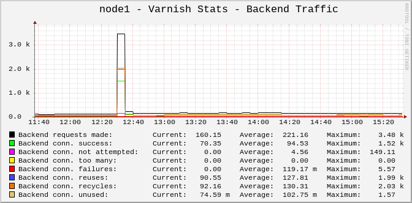

**Critbit data**

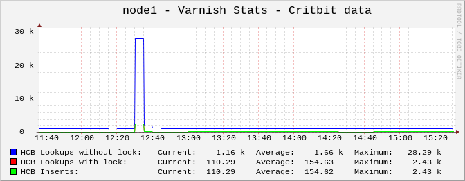

**Data structure sizes**

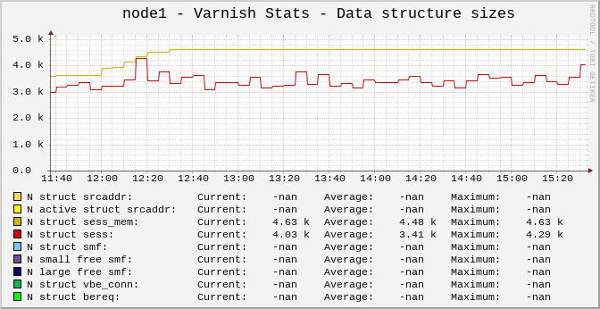

**ESI**

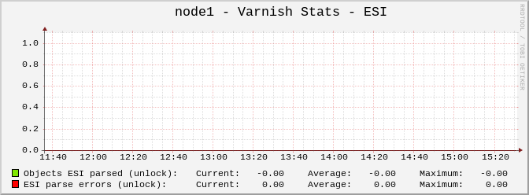

**Hitrate %**


**Hit rates**

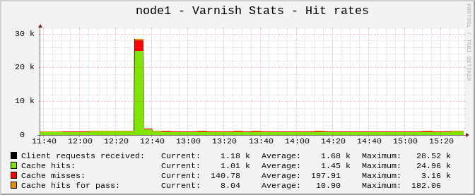

**LRU activity**

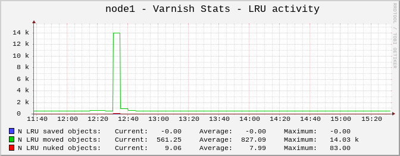

**Memory allocation requests**

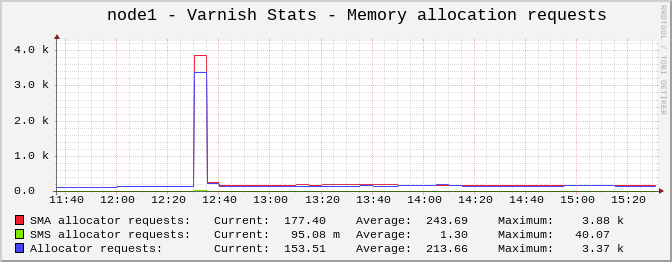

**Number of objects**


**Object expunging**


**Objects delivered with sendfile vs write**

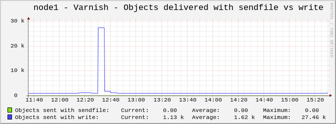

**Objects overflowing workspace**

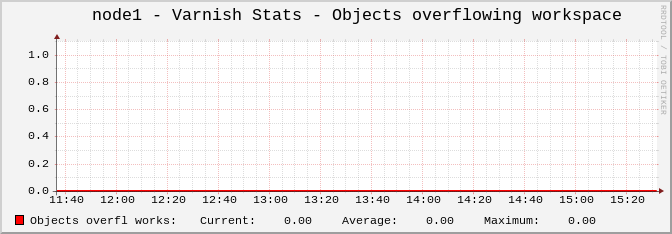

**Objects per objecthead**

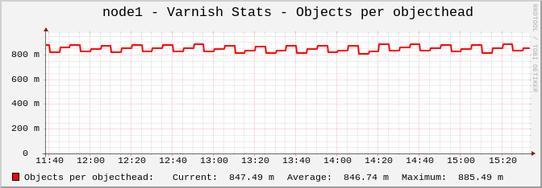

**Request rates**

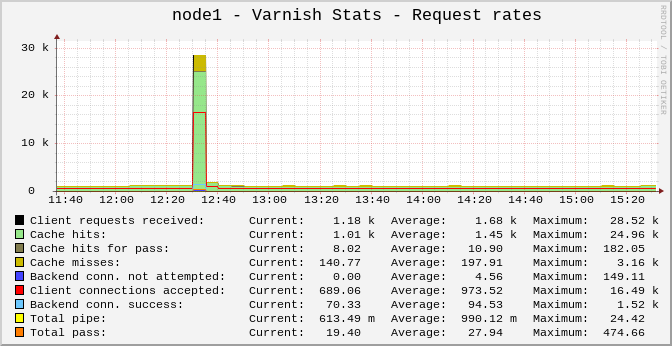

**Session herd**


**Sessions**


**Shared memory activity**


**SHM writes and records**

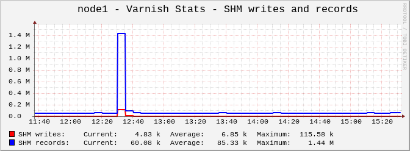

**Thread status**

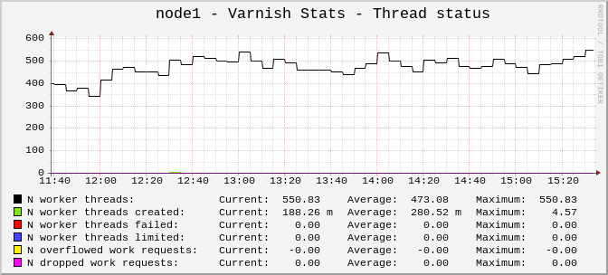

Author
------

Elan Ruusamäe <glen@delfi.ee>


  [1]: http://en.wikipedia.org/wiki/Inetd
  [2]: http://en.wikipedia.org/wiki/Xinetd
